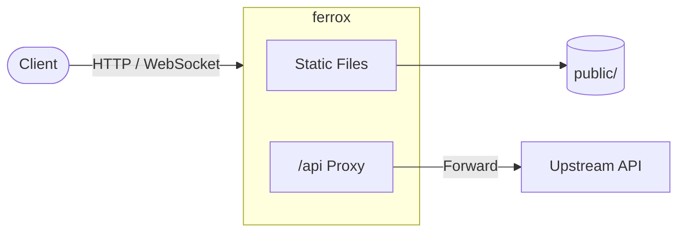

# ferrox

**A lightweight, security-conscious HTTP server and reverse proxy written in Rust.**

ferrox serves static files efficiently and proxies `/api` traffic to an upstream backend. It is designed for small-to-medium deployments where you want low resource usage, strong defaults against common web attacks, and a clean separation between your static assets and your application API.



## Features

- **Static file serving**
  - In-memory cache with mtime invalidation
  - Strong ETags (CRC32)
  - HTTP Range requests (single ranges)
  - On-the-fly gzip compression for compressible content
  - Sensible `Cache-Control` defaults by file type
  - Custom 404 page support

- **Reverse proxy** (`/api` and `/api/*`)
  - Transparent forwarding with `X-Forwarded-For`
  - WebSocket upgrade support
  - Request body size limits (default 10 MB)
  - Upstream timeouts

- **Security-focused defaults**
  - Path traversal protection (canonicalize + root confinement)
  - Slowloris mitigation via read-stall timeouts
  - Rejection of oversized request bodies (declared + streaming)
  - TRACE method disabled
  - Security headers (`X-Content-Type-Options`, `X-Frame-Options`, `Referrer-Policy`, etc.)

- **Observability**
  - Prometheus metrics at `/metrics`
  - Structured logging (plain or JSON via `FERROX_LOG_JSON=1`)
  - Graceful shutdown with connection drain

- **Optional TLS** (feature-gated)
- **Docker + Caddy** ready for production (TLS termination + rate limiting)

## Quick Start

### Prerequisites

- Rust 1.75+ (edition 2021)
- (Optional) Docker & Docker Compose

### Build & Run

```bash
git clone https://github.com/brian404/ferrox.git
cd ferrox

# Build
cargo build --release

# 
./target/release/ferrox
```

By default ferrox listens on `0.0.0.0:3000` and proxies `/api` to `127.0.0.1:8000`.

Visit:
- http://localhost:3000/          → static site
- http://localhost:3000/hello     → simple hello endpoint
- http://localhost:3000/health    → health check
- http://localhost:3000/metrics   → Prometheus metrics
- http://localhost:3000/api/...   → proxied to upstream

### Configuration

ferrox looks for configuration in this order:

1. `--config <path>` or `--config=<path>`
2. `FERROX_CONFIG` environment variable
3. `./ferrox.conf` (created automatically with defaults if missing)

Example `ferrox.conf`:

```toml
listen = "0.0.0.0:3000"
proxy_upstream = "127.0.0.1:8000"

# Optional TLS (requires building with --features tls)
# tls_cert = "/path/to/cert.pem"
# tls_key  = "/path/to/key.pem"
```

### Environment Variables

| Variable            | Description                                      | Default   |
|---------------------|--------------------------------------------------|-----------|
| `FERROX_PUBLIC_DIR` | Directory containing static files                | `public`  |
| `FERROX_CONFIG`     | Path to config file                              | `ferrox.conf` |
| `FERROX_LOG_JSON`   | Set to `1` or `true` for JSON logging            | `false`   |
| `RUST_LOG`          | Log level filter (e.g. `info`, `ferrox=debug`)   | -         |

## Docker

### Simple run

```bash
# Build the binary first, then:
docker build -t ferrox .
docker run --rm -p 3000:3000 ferrox
```

> **Note:** The current `Dockerfile` expects a pre-built release binary. A multi-stage build is recommended for production (see Development section).

### Full stack with Caddy (TLS + rate limiting)

```bash
export DOMAIN=your.domain.com
docker compose up --build
```

Caddy terminates TLS, applies rate limiting, and reverse-proxies to ferrox on port 3000.

## Architecture Overview

| Component              | Responsibility                                      |
|------------------------|-----------------------------------------------------|
| `main.rs`              | Process lifecycle, signals, graceful drain          |
| `lib.rs`               | Connection handling, TLS mode, HTTP/1.1 serve       |
| `router.rs`            | Request routing & metrics recording                 |
| `handlers/static_files`| Static serving, cache, ETag, Range, compression     |
| `handlers/proxy.rs`    | HTTP + WebSocket reverse proxy                      |
| `security.rs`          | Path traversal protection                           |
| `timeout_io.rs`        | Slowloris read-stall timeout                        |
| `body_limit.rs`        | Request body size enforcement                       |
| `cache.rs`             | In-memory static file cache                         |
| `metrics.rs`           | Prometheus exposition                               |

## Security Model

ferrox is intentionally conservative:

- All static paths are resolved with `canonicalize` and must remain under the public root.
- `..` segments are rejected early.
- Request bodies larger than 10 MB are rejected (both via `Content-Length` and streaming).
- Connections that stall on reads are closed after 30 seconds.
- The TRACE method is rejected.
- Common security headers are added to every response.

**Limitations you should be aware of:**

- The in-memory cache is currently unbounded (mitigate by limiting public assets or adding an external cache layer).
- Proxy responses are fully buffered in the current implementation.
- Rate limiting is expected to be handled by a front-end (Caddy, nginx, Cloudflare, etc.).
- No authentication is built-in; protect `/metrics` and any sensitive routes at the edge if needed.

## Metrics

`GET /metrics` exposes Prometheus text format:

- `ferrox_uptime_seconds`
- `ferrox_requests_total`
- `ferrox_response_bytes_total`
- `ferrox_requests_by_status_total{status="..."}`
- `ferrox_requests_by_route_total{route="..."}`
- `ferrox_cache_hits_total` / `ferrox_cache_misses_total`

## Development

```bash

cargo test


RUST_LOG=ferrox=debug cargo run

# Build with TLS support
cargo build --release --features tls
```

### Project layout

```
ferrox/
├── src/
│   ├── main.rs              # Binary entrypoint
│   ├── lib.rs               # Library + connection handling
│   ├── router.rs
│   ├── handlers/
│   │   ├── static_files.rs
│   │   ├── proxy.rs
│   │   ├── health.rs
│   │   └── hello.rs
│   ├── security.rs
│   ├── cache.rs
│   ├── compression.rs
│   ├── body_limit.rs
│   ├── timeout_io.rs
│   ├── metrics.rs
│   └── ...
├── public/                  # Static assets
├── tests/                   # Integration tests
├── Caddyfile
├── docker-compose.yml
└── Dockerfile
```

## Roadmap / Known Improvements

- Multi-stage Dockerfile
- Streaming proxy responses (avoid full buffering)
- Bounded / LRU cache
- Configurable timeouts and body limits
- HTTP/2 support
- Better observability (histograms, upstream latency)

Contributions are welcome.

## Contributions
Ferrox is an experimental HTTP server designed for experimentation and learning about HTTP internals with Rust. Ferrox is not currently production-grade. Feedback and contributions are very welcome!


**ferrox** — small, fast, and careful about the network edge.
